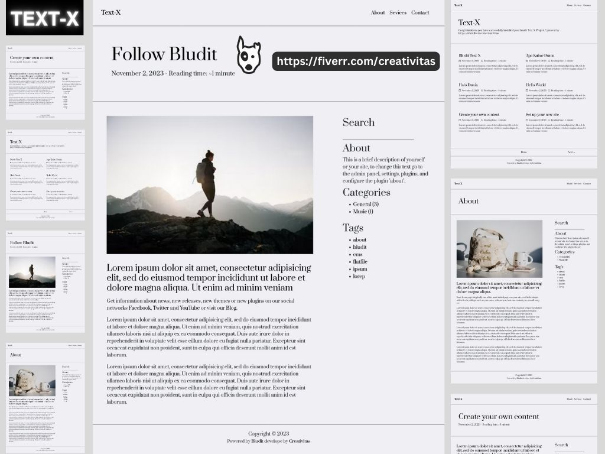
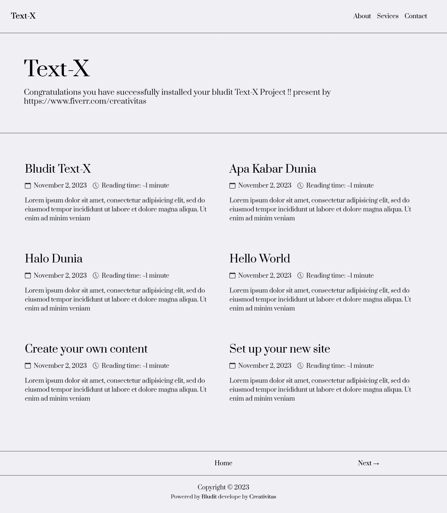
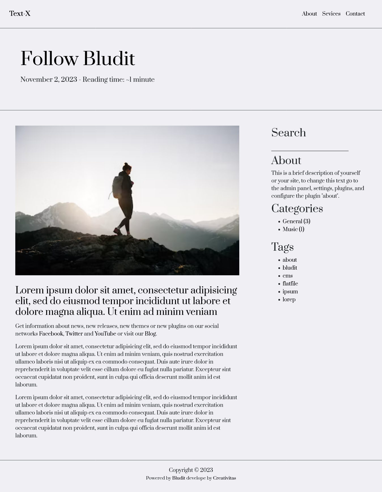
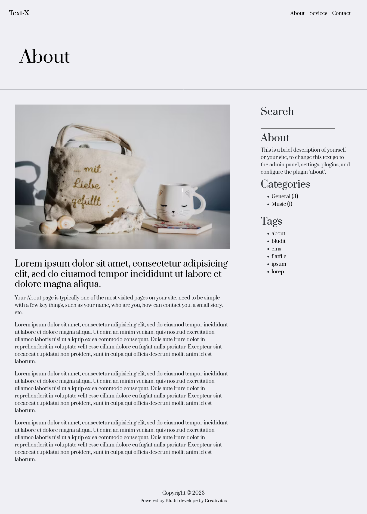
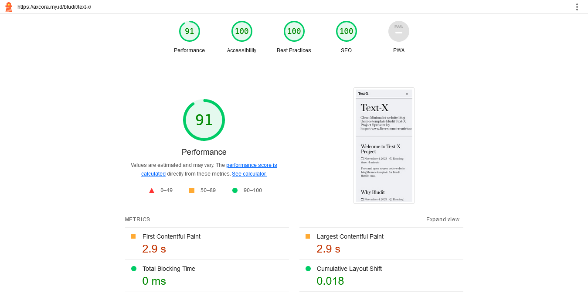
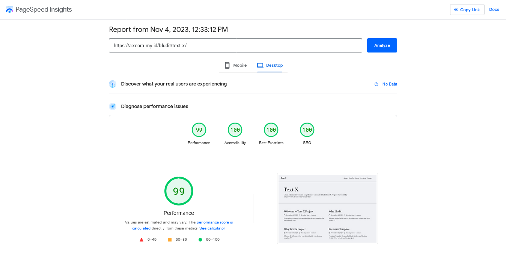
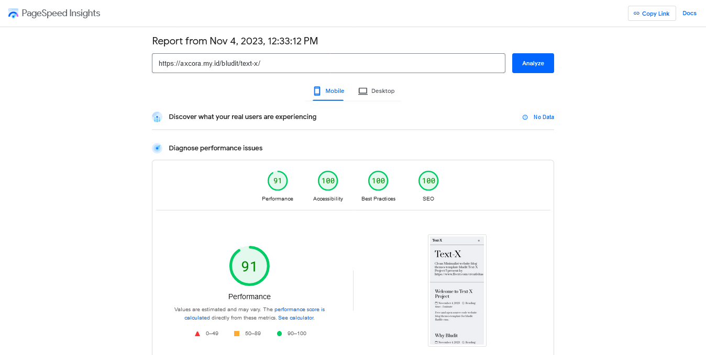
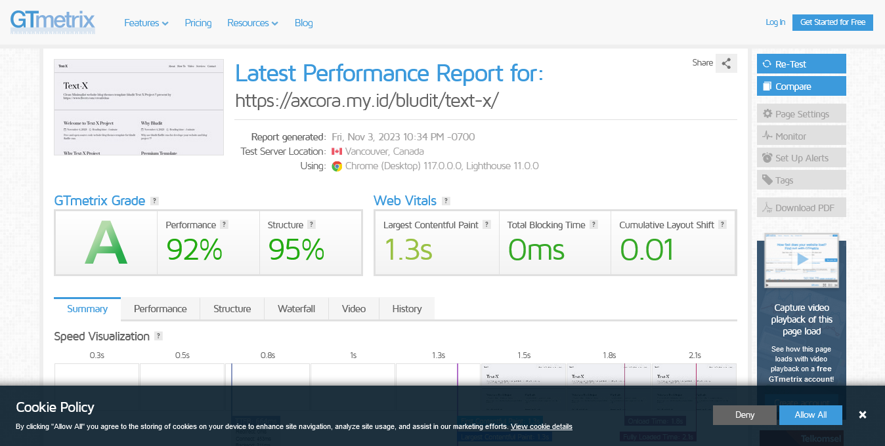

# Text-X Project

Free download and open source code clean minimalist blog deisgn UI for bludit flatfile CMS

present by creativitas 

[https://www.fiverr.com/creativitas](https://www.fiverr.com/creativitas)

Run Demo : [https://axcora.my.id/bludit/text-x](https://axcora.my.id/bludit/text-x)

Download with full installer : [Download Now →](https://creativitaz.gumroad.com/l/textx)

-----------------------------------------------------

### Design UI

Text-X Project help you for develope modern minimalist clean design blog.

Home Page Area

Post detail content article

Static page content

-----------------------------------------------------

### Test And Result

Google lighthouse test

Google Page Speed Desktop

Google Page Speed Mobile

GT Metrix Result

-----------------------------------------------------

### Installation

+ Make sure you have run bludit cms on your website or blog project.
+ If you need full installation package [Download Text-X with installer →](https://creativitaz.gumroad.com/l/textx)
+ Upload this source code project on your web host on project/bl-themes
+ Access backend admin - click on template / themes - and activate Text-X
+ Done

-----------------------------------------------------

present by creativitas 

[https://www.fiverr.com/creativitas](https://www.fiverr.com/creativitas)

Run Demo : [https://axcora.my.id/bludit/text-x](https://axcora.my.id/bludit/text-x)

Download with full installer : [Download Now →](https://creativitaz.gumroad.com/l/textx)

Have custom web blog project, hire now 
[https://www.fiverr.com/creativitas](https://www.fiverr.com/creativitas)
